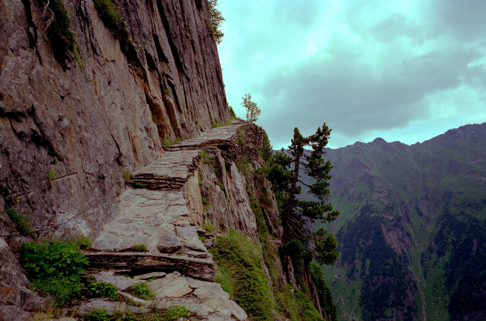
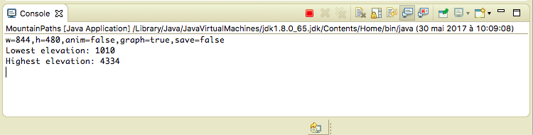
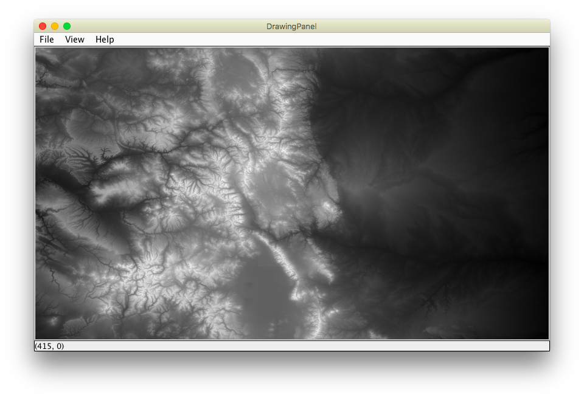
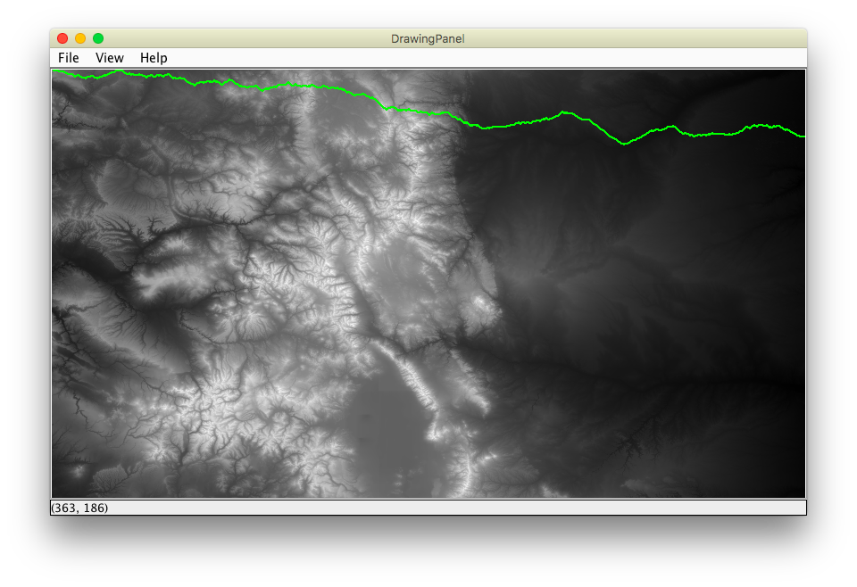
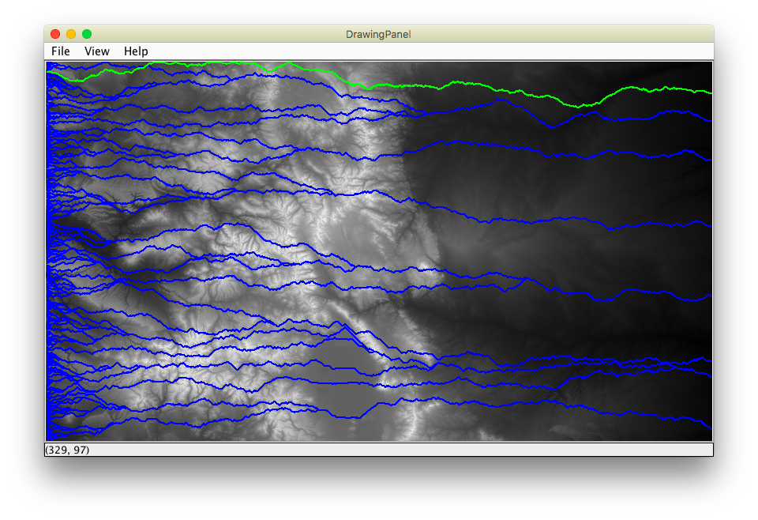

 
 

# Mountain Path Project

## Summary
Find and draw a good path on which to cross the state of Colorado by foot.

## Getting Started
1. Clone the starter project from this repository: https://github.com/daltonschool/MountainPathProject.git
2. Look at MountainPaths.java. This is what you will edit.
3. DrawingPanel.java has been written for you. You do not need to change it.

## Overview
We want to cross the state of Colorado by foot. The west-to-east distance is fixed, but we have a choice over which hills, mountains, and valleys we encounter along the way. If we choose poorly the trip is so much harder! This project will determine a good route to take. 

The project contains a file with all the elevations of Colaroada (in feet, in 1x1 squares). You will draw an elevation map where white represents the highest elevation, black the lowest, and shades of gray in between. Then you try several paths across the state and compute the total elevation changes for each one. For each path, you'll make decisions if we should step straight ahead, diagnonally north or diagonally south. Finally, you'll declare which path has the least elevation change, and that's the one we'll take! 

## Instructions
1. Fill a 2D array of ints with the elevation data from the file by completing the function fillGrid().
1. To color the map, we want to use white for the highest elevation, black for the lowest elevation, and degrees of gray in between. To do this, first find the minimum and maxiumum values in the array by completing getMin() and getMax(). 

   **Checkpoint:** After this step, the Lowest Elevation and Highest Elevation will print to the console.
    
    
1. Now you can draw the map by completing the function drawMap().

   **Checkpoint:** After this step, the graphics panel will look like this:
   

1. Complete the function drawGreedyPath(). In this function, compute the elevation changes for 3 choices: straight ahead (the column directly in front, in the same row), diagonally north (the column directly in front, but in the row one up), and diagonally south (the column directly in front but one row down).  Pick the best direction to take, i.e. the one with the least elevation change. Keep doing this for all the columns.  

   **Checkpoint:** After this step, the graphics panel will look like this:
   
   
 1. Complete Step 5 in the main method, which asks you to call drawGreedyPath() for every row of the data and keep track of which is the best one.
 
    **Checkpoint:** After this step, the graphics panel will look like this:
   
   
## Conclusion   
The console will print out the best row to start the journey on. Which row is it?

 
 

